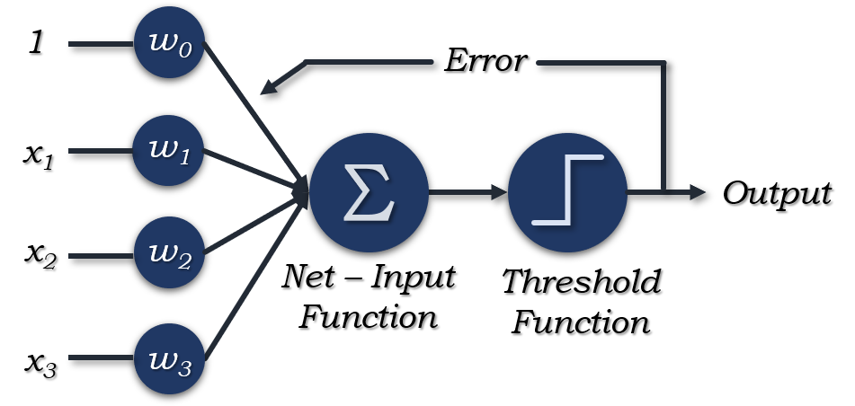
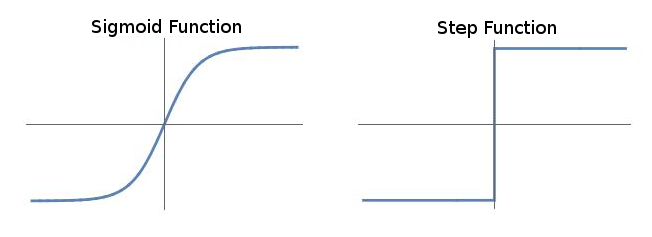
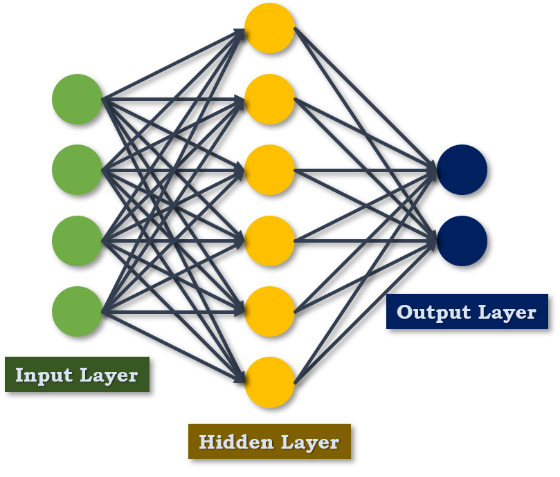
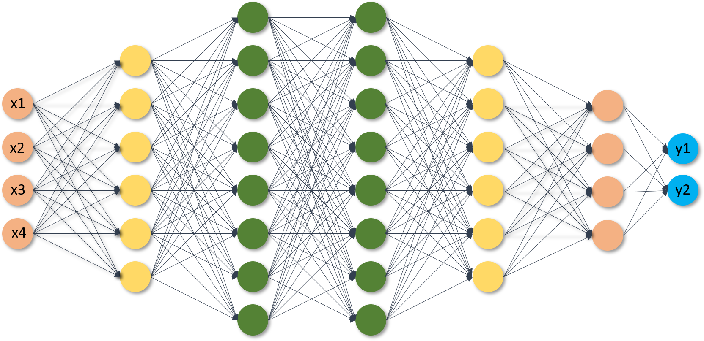
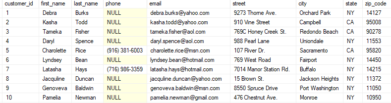

# Introduction to Deep Learning

## What is a Neural Network?

- **Single Neuron**: Linear regression without applying activation(perceptron) which looks likes as follows:

  

- A single neuron calculates weighted sum of inputs i.e. and then we set a threshold to predict output in perceptron.

- A perceptron can take real valued input or Boolean valued and when  then the perceptron outputs 0.

- **Disadvantage of Perceptron**: Perceptron only outputs binary values and if we try to give small change in weight and bias then perceptron can flip the output.

- To overcome this we use the sigmoid function which makes slight changes to the output with the changes in weights and biases. For example, If the output using some weights and bias in perceptron is 0 and we change the weights and bias slightly then the output becomes = 1 but the actual output in that case was 0.7. In case of sigmoid, initial output = 0 but with slight modification output will be exact same 0.7.

- Applying sigmoid activation function to a single neuron makes it to act like logistic regression.

- The difference between sigmoid and perceptron can be visualized as follows:

  

- Simple Neural Network:

  

- **ReLu**: It stands for Rectified Linear Unit. It is most popular activation function making deep neural network training faster.

- Hidden layer predicts connection between inputs automatically, that's what deep learning is good at.

- Deep Neural Network consists of more hidden layers (Deeper Layers): 

  

- Each input in the neural network is connected to the hidden layer and the neural network decides all the connections.

## Supervised Learning with Neural Network

- **Supervised Learning**: We are provided with the input and their labels i.e., (X,Y) and we have to find a function that maps X to Y so that we can make further predictions.

- Types of Neural Networks and examples:

  | Features           | To Predict             | Application         | Domain                                |
  | ------------------ | ---------------------- | ------------------- | ------------------------------------- |
  | Home Features      | Price                  | Real Estate         | Standard Neural Network               |
  | Ad, User info      | Click on ad (0/1)      | Online Advertising  | Standard Neural Network               |
  | Image              | Object(1.....10000)    | Photo Tagging       | Convolutional Neural Network          |
  | Audio              | Text Transcript        | Speech Recognition  | Recurrent Neural Network              |
  | English            | to Hindi               | Machine Translation | More complex version of RNN           |
  | Image, Radar Info. | Position of other Cars | Autonomous Driving  | Custom hybrid version of CNN and RNNs |

- Structured Data: The are like databases and tables where data are very well organized. For example,

  <table>
      <tr>
      	<td>
              
          </td>
          <td>
          	
          </td>
      </tr>
  </table>

- Unstructured Data: Images, videos, text, audio, etc.

  <table>
      <tr>
      	<td style="width:50%">
              
          </td>
          <td style="width:50%;text-align:center">
          	
          </td>
      </tr>
  </table>

## Why is Deep Learning Taking Off?

