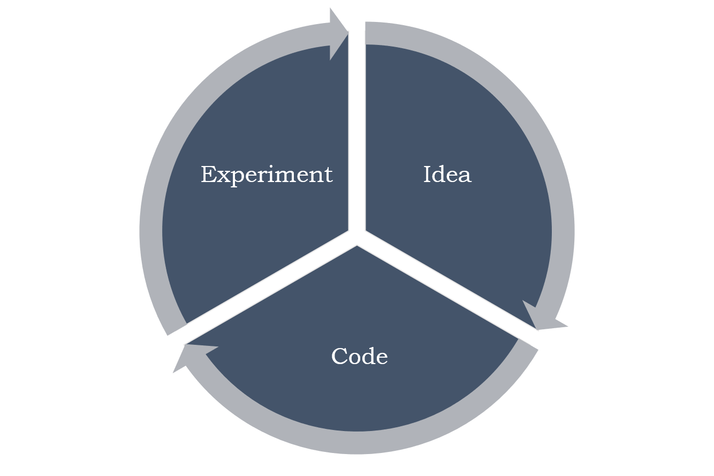
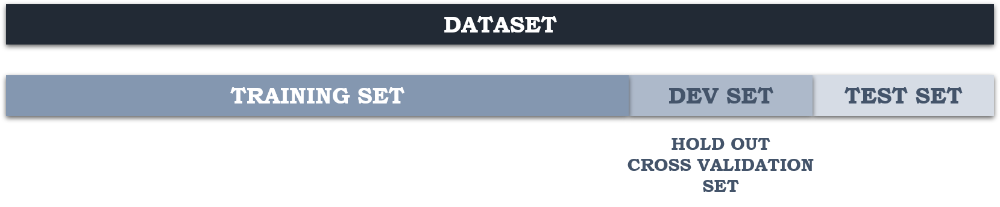
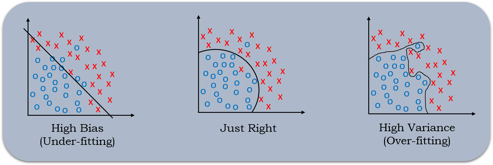
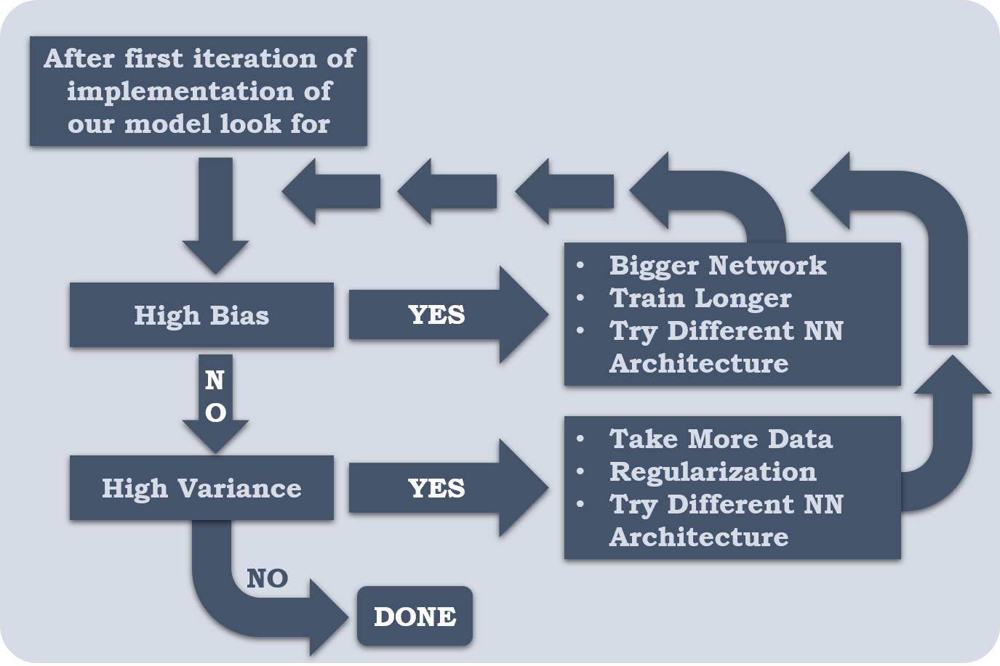

# **Practical Aspects of Deep Learning**

## **Train / Dev / Test Sets**

- It is impossible to get all our hyperparameters guessed correctly on a new application at the first attempt. So we have to through the following  loop:

  

- We have go through this loop many times in order to figure out the perfect hyperparameter values for our application.

- For efficient looping we have to split our data into different parts as follows into:

  

  Train set

  Hold-out cross validation / Development Set

  Testing Set

- We will try to build a model upon training set then try to optimize hyperparameters on dev set as much as possible. Then after our model is ready we try and evaluate the testing set.
- The trend on the ratio of splitting the models:
  - If the size of the dataset size is 100 to 10000 then the train/dev/test set ratio will be like 60/20/20
  - If the size of the dataset size is in millions then the train/dev/test set ratio will be like 98/1/1% or 99.5/0.25/0.25% or 99.5/0.4/0.1% respectively.
  - The trend now gives the training data the biggest set.
- We also have to make sure that the dev and test set comes from the same distribution
  
  - For example, if cat training pictures are taken from the web which are high quality images  and the dev/test pictures are from users cell phone which are of low quality then the distribution will mismatch. So it is a good idea to make sure that the dev/test set are coming from the same distribution.
- The dev/set rule is to try them on some of the good models we have created.
  
  - Its okay to have only a dev set without a testing set. But a lot of people in this case call the dev-set as the test set. A better terminology is to call it as dev set as it is used in the development.

## **Bias Variance**

- Bias/Variance techniques are easy to learn, but difficult to master.

- Explanation of Bias/Variance:

  

  If our model is underfitting (logistic regression of no linear data) then it has a "**high bias**". If the model is overfitting then it has "**high variance**". The model will be alright if it has bias and variance balanced.

- The above idea works for 2-D data where visualization is very easy. For more than 2 dimensional data we have to follow following approach.

  |                | High Variance (Over-fitting) | High Bias  (Under-fitting) | High  Bias (Under- Fitting) && High Variance (Over-fitting) | Best |
  | -------------- | :--------------------------: | :------------------------: | :---------------------------------------------------------: | :--: |
  | Training Error |              1%              |            15%             |                             15%                             | 0.5% |
  | Test Error     |             11%              |            14%             |                             30%                             |  1%  |

  These assumptions came from the fact that the humans have 0% error. If the problem isn't like that then we'll need to use human error as base line.

## **Basic Recipe for Machine Learning**

- If our algorithm has a high bias then we should

  - Try to make our network bigger (by increasing size of hidden units or number of hidden layers)
  - Try a different model which is suitable for our data.
  - Try to run it for longer time.
  - Different advanced optimization algorithms.

- If our algorithm has a high variance then we should

  - Get more data if possible
  - If getting more data is not possible then we should try regularization
  - Try a different model which is suitable for our chosen data.

  

- We should try the above cycle until we get a balance low bias/variance.

- In early days of machine learning before deep learning people were talking of "Bias/Variance trade off". But now we have more tools to solve bias and variance problems so it is really helpful in deep learning.

- Training a bigger neural network never hurts.

## **Regularization**

- We can reduce high variance/overfitting of our neural network by adding regularization to our neural network.

- L1 matrix norm:

  

  - Sum of absolute values of all $\large w$s.

- L2 matrix norm:

  

<ins>**Regularization for Logistic Regression**</ins>

- The normal cost function that we want to minimize is

  

- The L2 regularization version:

  

  ​														**OR**

  

  - For arcane technical math reasons called as **Frobenius Norm**.

  - We can add the bias squared term in our regularized expression but 

- The L1 regularization version:

  

- The L1 regularization makes $\large w$ sparse by making a lot of values in $\large w$ zero which makes the model size smaller.

- L2 regularization is being used much more often.

- $\lambda$ here is the regularization parameter (hyperparameter).

<ins>**Regularization for Neural Network**</ins>

- The normal cost function that we want to minimize is:

   

- The L2 regularization version:

  

- We stack the matrix as one vector (m~n~, 1) and then we apply 

  

- For backpropagation before applying regularization:

  

- Back propagation with regularization:

  

- The update step will be

  

  

  

  

  $$\large \space \space \space \space \space \space \space $$ 

- In practice this penalizes large weights and effectively limits the freedom of our model.

- The new term causes the **weight to decay** in proportion to its size so L2 regularization is also called **weight decay**.

