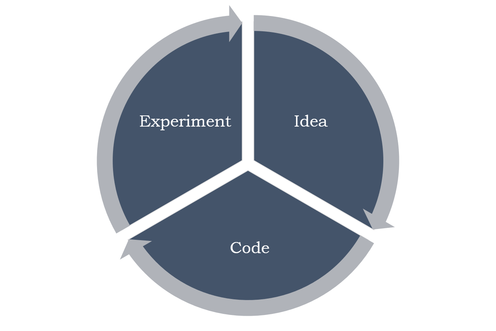
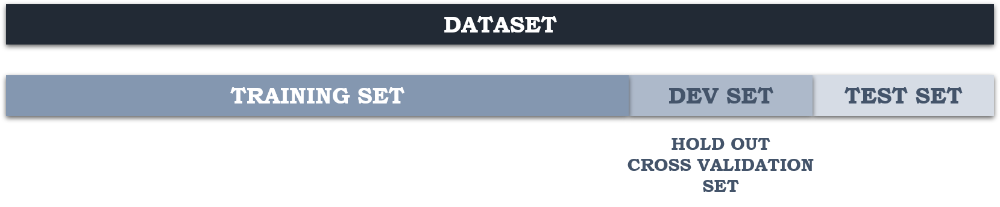
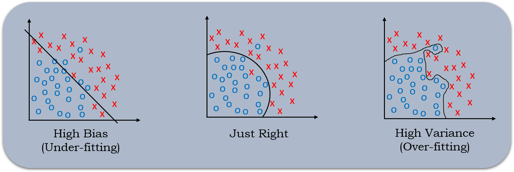
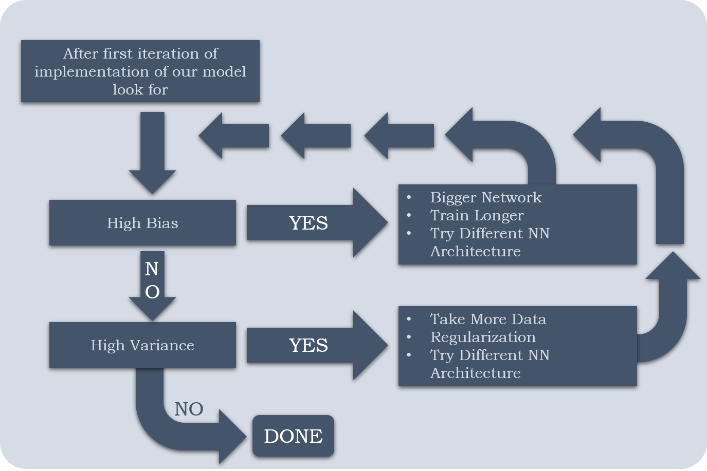
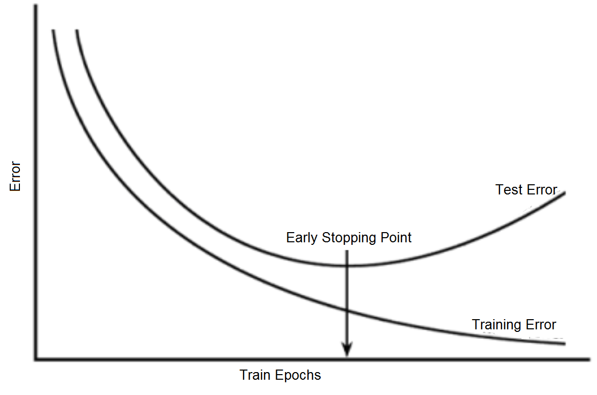
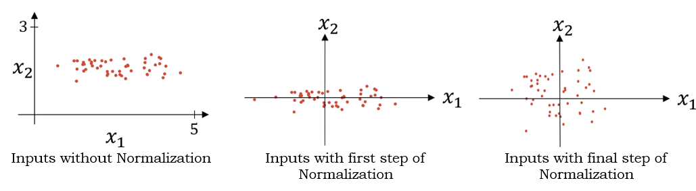
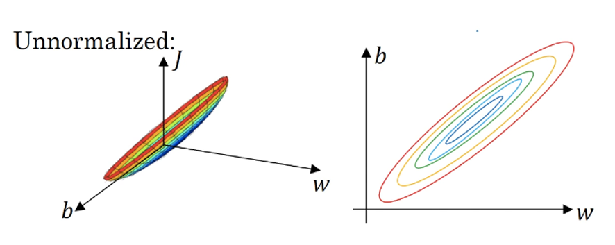
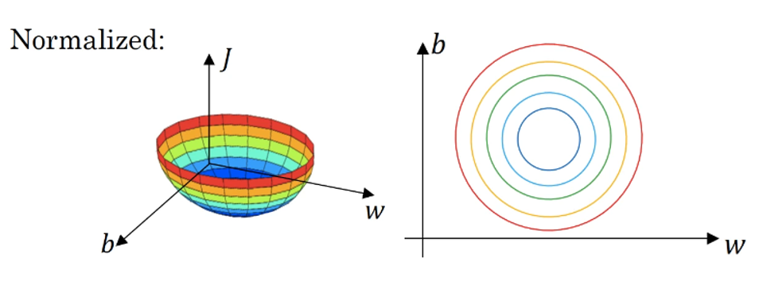

# **Practical Aspects of Deep Learning**

## **Train / Dev / Test Sets**

- It is impossible to get all our hyperparameters guessed correctly on a new application at the first attempt. So we have to through the following  loop:

  

- We have go through this loop many times in order to figure out the perfect hyperparameter values for our application.

- For efficient looping we have to split our data into different parts as follows into:

  

  Train set

  Hold-out cross validation / Development Set

  Testing Set

- We will try to build a model upon training set then try to optimize hyperparameters on dev set as much as possible. Then after our model is ready we try and evaluate the testing set.
- The trend on the ratio of splitting the models:
  - If the size of the dataset size is 100 to 10000 then the train/dev/test set ratio will be like 60/20/20
  - If the size of the dataset size is in millions then the train/dev/test set ratio will be like 98/1/1% or 99.5/0.25/0.25% or 99.5/0.4/0.1% respectively.
  - The trend now gives the training data the biggest set.
- We also have to make sure that the dev and test set comes from the same distribution
  
  - For example, if cat training pictures are taken from the web which are high quality images  and the dev/test pictures are from users cell phone which are of low quality then the distribution will mismatch. So it is a good idea to make sure that the dev/test set are coming from the same distribution.
- The dev/set rule is to try them on some of the good models we have created.
  
  - Its okay to have only a dev set without a testing set. But a lot of people in this case call the dev-set as the test set. A better terminology is to call it as dev set as it is used in the development.

## **Bias Variance**

- Bias/Variance techniques are easy to learn, but difficult to master.

- Explanation of Bias/Variance:

  

  If our model is underfitting (logistic regression of no linear data) then it has a "**high bias**". If the model is overfitting then it has "**high variance**". The model will be alright if it has bias and variance balanced.

- The above idea works for 2-D data where visualization is very easy. For more than 2 dimensional data we have to follow following approach.

  |                | High Variance (Over-fitting) | High Bias  (Under-fitting) | High  Bias (Under- Fitting) && High Variance (Over-fitting) | Best |
  | -------------- | :--------------------------: | :------------------------: | :---------------------------------------------------------: | :--: |
  | Training Error |              1%              |            15%             |                             15%                             | 0.5% |
  | Test Error     |             11%              |            14%             |                             30%                             |  1%  |

  These assumptions came from the fact that the humans have 0% error. If the problem isn't like that then we'll need to use human error as base line.

## **Basic Recipe for Machine Learning**

- If our algorithm has a high bias then we should

  - Try to make our network bigger (by increasing size of hidden units or number of hidden layers)
  - Try a different model which is suitable for our data.
  - Try to run it for longer time.
  - Different advanced optimization algorithms.

- If our algorithm has a high variance then we should

  - Get more data if possible
  - If getting more data is not possible then we should try regularization
  - Try a different model which is suitable for our chosen data.

  

- We should try the above cycle until we get a balance low bias/variance.

- In early days of machine learning before deep learning people were talking of "Bias/Variance trade off". But now we have more tools to solve bias and variance problems so it is really helpful in deep learning.

- Training a bigger neural network never hurts.

## **Regularization**

- We can reduce high variance/over-fitting of our neural network by adding regularization to our neural network.

- L1 matrix norm:

  <a href="https://www.codecogs.com/eqnedit.php?latex=\Large&space;||w||=\sum_{j=1}^{n_x}(|w_{i,j}|)" target="_blank"></a>

  - Sum of absolute values of all <a href="https://www.codecogs.com/eqnedit.php?latex=\large&space;w" target="_blank"></a>s.

- L2 matrix norm:

  <a href="https://www.codecogs.com/eqnedit.php?latex=\Large&space;||w||^{2}_2=\sum_{j=1}^{n_x}|w_{j}|^{2}=w^{T}w" target="_blank"></a>

<ins>**Regularization for Logistic Regression**</ins>

- The normal cost function that we want to minimize is

  <a href="https://www.codecogs.com/eqnedit.php?latex=\Large&space;J(w,b)=\frac{1}{m}&space;\sum_{i=1}^{m}\mathcal{L}(\hat{y},y)" target="_blank"></a>

- The L2 regularization version:

  <a href="https://www.codecogs.com/eqnedit.php?latex=\Large&space;J(w,b)=\frac{1}{m}&space;\sum_{i=1}^{m}\mathcal{L}(\hat{y},y)&space;&plus;&space;\frac{\lambda}{2m}||w||_{2}^{2}" target="_blank"></a>

  ​														**OR**

  - <a href="https://www.codecogs.com/eqnedit.php?latex=\Large&space;J(w,b)=\frac{1}{m}&space;\sum_{i=1}^{m}\mathcal{L}(\hat{y},y)&space;&plus;&space;\frac{\lambda}{2m}||w||_{2}^{2}&space;&plus;&space;\frac{\lambda}{2m}||b||^{2}" target="_blank"></a>
- For arcane technical math reasons called as **Frobenius Norm**.
  - We can add the bias squared term in our regularized expression but 

- The L1 regularization version:

  <a href="https://www.codecogs.com/eqnedit.php?latex=\large&space;J(w,b)=\frac{1}{m}&space;\sum_{i=1}^{m}\mathcal{L}(\hat{y},y)&space;&plus;&space;\frac{\lambda}{2m}||w||_{1}" target="_blank"></a>

- The L1 regularization makes <a href="https://www.codecogs.com/eqnedit.php?latex=\large&space;w" target="_blank"></a> sparse by making a lot of values in $\large w$ zero which makes the model size smaller.

- L2 regularization is being used much more often.

- <a href="https://www.codecogs.com/eqnedit.php?latex=\lambda" target="_blank"></a> here is the regularization parameter (hyperparameter).

<ins>**Regularization for Neural Network**</ins>

- The normal cost function that we want to minimize is:

  <a href="https://www.codecogs.com/eqnedit.php?latex=\Large&space;J(w^{[1]},b^{[1]},...w^{[l]},b^{[l]})=\frac{1}{m}\sum_{i=1}^{m}\mathcal{L}(\hat{y}_i,y_i)" target="_blank"></a>

- The L2 regularization version:

  <a href="https://www.codecogs.com/eqnedit.php?latex=\Large&space;J(w^{[l]},b^{[l]})=\frac{1}{m}\sum_{i=1}^{m}\mathcal{L}(\hat{y}_i,y_i)&plus;&space;\frac{\lambda}{2m}||w^{[l]}||_{F}^{2}" target="_blank"></a>

- We stack the matrix as one vector (m~n~, 1) and then we apply 

  <a href="https://www.codecogs.com/eqnedit.php?latex=\Large&space;\sqrt{(w1^2&space;&plus;&space;w2^2&plus;...&plus;)}" target="_blank"></a>

- For back-propagation before applying regularization:

  <a href="https://www.codecogs.com/eqnedit.php?latex=\Large&space;dw^{[l]}=from\space&space;backprop" target="_blank"></a>

- Back propagation with regularization:

  <a href="https://www.codecogs.com/eqnedit.php?latex=\Large&space;dw^{[l]}=(from&space;\hspace{.2cm}&space;backpropagation)&space;&plus;\frac{\lambda}{m}w^{[l]}" target="_blank"></a>

- The update step will be

  <a href="https://www.codecogs.com/eqnedit.php?latex=\Large&space;w^{[l]}=w^{[l]}-\alpha&space;\space&space;dw^{[l]}" target="_blank"></a>

  <a href="https://www.codecogs.com/eqnedit.php?latex=\Large&space;w^{[l]}=w^{[l]}-\alpha&space;[(from&space;\hspace{0.2cm}&space;backpropagation)&plus;\frac{\lambda}{m}w^{[l]}]" target="_blank"></a>

  <a href="https://www.codecogs.com/eqnedit.php?latex=\Large&space;\space&space;\space&space;\space&space;\space&space;\space&space;\space&space;\space=w^{[l]}-\frac{\alpha&space;\lambda}{m}w^{[l]}-\alpha&space;\times&space;(from&space;\hspace{.2cm}&space;backpropagation)" target="_blank"></a>

  <a href="https://www.codecogs.com/eqnedit.php?latex=\Large&space;\space&space;\space&space;\space&space;\space&space;\space&space;\space&space;\space=w^{[l]}[1-\frac{\alpha&space;\lambda}{m}]-\alpha&space;\times&space;(from&space;\hspace{.2cm}&space;backpropagation)" target="_blank"></a>

- In practice this penalizes large weights and effectively limits the freedom of our model.

- The new term <a href="https://www.codecogs.com/eqnedit.php?latex=\inline&space;\Large&space;[1-(\frac&space;{\alpha&space;\lambda}{m})]w^{[l]}" target="_blank"></a> causes the **weight to decay** in proportion to its size so L2 regularization is also called **weight decay**.

## **Why Regularization Reduces Overfitting?**

**Intuition 1**

- If <a href="https://www.codecogs.com/eqnedit.php?latex=\lambda" target="_blank"></a>  is too large - a lot of <a href="https://www.codecogs.com/eqnedit.php?latex=\large&space;w" target="_blank"></a>s will be close to zeros which will make NN simpler which can be thought of nearly behaving as logistic regression.
- If <a href="https://www.codecogs.com/eqnedit.php?latex=\lambda" target="_blank"></a> is good enough it will just reduce some weights that makes the neural network overfit.

**Intuition 2**

- If <a href="https://www.codecogs.com/eqnedit.php?latex=\lambda" target="_blank"></a> is too large, <a href="https://www.codecogs.com/eqnedit.php?latex=\large&space;w" target="_blank"></a>s will be small (close to zero), and will use linear part of the *tanh* activation function, so we will go from non linear activation to *roughly* linear which would make the neural network a *roughly* linear classifier.
- If `lambda` is good enough it will just make some of *tanh* activations *roughly* linear which will prevent overfitting.

**Implementation Tip**:

If we implement gradient descent, one of the steps to debug gradient descent is to plot the cost function J as a function of the number of iterations of the gradient descent and we want to see that the cost function J decreases monotonically after every elevation of gradient descent with regularization. If we plot the old definition of J (no regularization) then we might not see it to decrease monotonically.

## **Dropout Regularization**

- The dropout regularization eliminates some of the neurons/weights on each iteration based on a probability.

- A most common technique to implement dropout is called "**inverted dropout**".

- Code for inverted dropout:

  ```python
  keep_prob = 0.8  		# 0 <= keep_prob <= 1
  l = 3					# For layer 3 
  # The generated number that are less than 0.8 will be dropped. 80% stay 20% dropped
  d3 = np.random.rand(a[l].shape[0], a[l].shape[1]) < keep_prob
  
  a3 = np.multiply(a3,d3) # keep only the values in d3
  
  # Increasing a3 to not reduce the expected value of output (ensures that the expected value of a3 remains the same) - to solve the scaling problem
  a3 = a3/keep_prob
  ```

## **Understanding  Dropout**

- Our last intuition was that dropout randomly knocks out units in our neural network. So it's as if on every iteration we're working with smaller NN, and so using a smaller NN seems like it should have a regularizing effect.
- Another intuition can't rely on any one feature, so we have to spread out weights.
- It's possible to show that dropout has a similar effect to L2 regularization.
- Dropout can have different `keep_prob` per layer.
- The input layer dropout has to be near 1(or 1 - no of dropout) because we don't want to eliminate a lot of features.
- If there are chances of overfitting in some layers than others, we can set a lower `keep_prob` for some layers than others. The downside is, this gives us even more hyperparameters to search for using cross-validation. One other alternative might be to have some layers where we don't apply dropout and then just have one hyperparameter, which is `keep_prob` for the layers for which we do apply dropouts.
- A lot of researchers are using dropout with Computer Vision (CV) because they have a very big input size and almost never have enough data, so overfitting is the usual problem. And dropout is a regularization technique to prevent overfitting.
- A downside of dropout is that the cost function J is not well defined and it will be hard to debug (plot J by iteration).
  - To solve that we'll need to turn off dropout, set all the `keep_prob` to 1, and then run the code and check that it monotonically decreases j and then turn on the dropouts again.

## **Other Regularization Methods**

1. **Data Augmentation**

   - In Computer Vision application of deep learning:
     - We can flip all our pictures horizontally which will give us <a href="https://www.codecogs.com/eqnedit.php?latex=\inline&space;\large&space;m" target="_blank"></a> more data instances.
     - We can also apply a random position and rotation to an image to get more data.
   - For example, in OCR we can impose random rotations and distortions to digits or letters.
   - New data obtained using this technique isn't as good as the real independent data, but still can be used as a regularization technique.

2. **Early Stopping**

   - In this method or technique we plot the training set and the dev set cost together for each iteration. At some iteration the dev-set cost will stop decreasing and will start increasing.

   - We will pick the point at which the training set error and dev set error are best (lowest training cost with lowest dev set cost).

   - We will take these parameters as the best parameters.

     

   - Andrew prefers to use L2 regularization instead of early stopping because this technique simultaneously tries to minimize the cost function and not to overfit which contradicts the orthogonalization approach.
   
   - An advantage of using **early stopping** is that we don't need to search for hyperparameter like in other regularization approaches (like searching for correct value of <a href="https://www.codecogs.com/eqnedit.php?latex=\lambda" target="_blank"></a>  in L2 regularization).
   
3. **Model Ensembles**

   - Algorithm:
     - Train multiple independent models.
     - At test time average their results.
   - It can get us an extra 2% improvement in performance.
   - It also reduces the generalization error.
   - We can use some snapshots of our NN at the training, ensembles them and take the results.

## **Normalizing Inputs**

- Normalizing inputs speeds up the training process a lot.

- Steps to follow for Normalizing Inputs:

  1. Get the mean of the training set: 

     <a href="https://www.codecogs.com/eqnedit.php?latex=\large&space;\mu&space;=&space;\frac{1}{m}&space;\sum_{i=1}^m&space;x^{(i)}" target="_blank"></a>

  2. Subtract the mean from each input:

     <a href="https://www.codecogs.com/eqnedit.php?latex=\large&space;X&space;=&space;X&space;-&space;\mu" target="_blank"></a>

     - This makes our input centered around $0$.

  3. Get the variance of the training set:

     <a href="https://www.codecogs.com/eqnedit.php?latex=\large&space;\sigma&space;=&space;\frac{1}{m}&space;\sum_{i=1}^{m}(x^{(i)})^2" target="_blank"></a>

  4. Normalize the variance:

     <a href="https://www.codecogs.com/eqnedit.php?latex=\large&space;X&space;=&space;X/\sigma" target="_blank"></a>

- The above steps should be applied to training, dev and test sets using the same mean(<a href="https://www.codecogs.com/eqnedit.php?latex=\mu" target="_blank"></a>) and variance(<a href="https://www.codecogs.com/eqnedit.php?latex=\sigma" target="_blank"></a>).

- The inputs before and after normalization is shown below:

  

<ins>**Why Normalize?**</ins>

- If we don't normalize the inputs our cost function will be deep and its shape will be inconsistent(elongated) as shown below, then optimizing it will take long time.

  

- But if we normalize it then the shape of our cost will be consistent (look more symmetric like circle in 2D) and we can use a larger learning rate alpha - the optimization will be faster.

  

## **Vanishing/ Exploding Gradients**

- The vanishing/exploding gradients occurs when our derivatives become very small or very big.

- To understand the problem, suppose that we have a deep neural network with number of layers <a href="https://www.codecogs.com/eqnedit.php?latex=\large&space;L" target="_blank"></a>, and all the activation functions are linear and each bias <a href="https://www.codecogs.com/eqnedit.php?latex=\large&space;b=0" target="_blank"></a> then we have:

  ​	<a href="https://www.codecogs.com/eqnedit.php?latex=\large&space;Y'&space;=&space;W^{[l]}W^{[l-1]}...W^{[3]}W^{[2]}W^{[1]}&space;X" target="_blank"></a>

  - If we have two hidden units per layer and <a href="https://www.codecogs.com/eqnedit.php?latex=\large&space;x_1=x_2=1" target="_blank"></a>, then :

    - If 

      <a href="https://www.codecogs.com/eqnedit.php?latex=\large&space;W^{[l]}&space;=&space;\begin{bmatrix}&space;1.5&space;&&space;0\\&space;0&space;&&space;1.5&space;\end{bmatrix}" target="_blank"></a>		 <a href="https://www.codecogs.com/eqnedit.php?latex=\large&space;l&space;\neq&space;L" target="_blank"></a> because of different dimensions in the output

      then

      <a href="https://www.codecogs.com/eqnedit.php?latex=\large&space;Y'&space;=&space;W^{[L]}&space;\begin{bmatrix}&space;1.5&space;&&space;0&space;\\&space;0&space;&&space;1.5&space;\end{bmatrix}^{(L-1)}&space;X&space;=&space;1.5^{L}" target="_blank"></a>	which will be very large 

    - If 

      <a href="https://www.codecogs.com/eqnedit.php?latex=\large&space;W^{[l]}&space;=&space;\begin{bmatrix}&space;0.5&space;&&space;0\\&space;0&space;&&space;0.5&space;\end{bmatrix}" target="_blank"></a>		 

      then

      <a href="https://www.codecogs.com/eqnedit.php?latex=\large&space;Y'&space;=&space;W^{[L]}&space;\begin{bmatrix}&space;0.5&space;&&space;0&space;\\&space;0&space;&&space;0.5&space;\end{bmatrix}^{(L-1)}&space;X&space;=&space;1.5^{L}" target="_blank"></a>	which will be very small

  -  We can see that the activations (and similarly derivatives) will decrease/increase exponentially as a function of number of layers.

- The last example explains that the activations (and similarly derivatives) will be decreased/increased exponentially as a function of number of layers.
- So If <a href="https://www.codecogs.com/eqnedit.php?latex=W&space;>&space;I" target="_blank">&space;I" title="W > I" /></a> (Identity matrix) the activation and gradients will explode.
- And If W < I (Identity matrix) the activation and gradients will vanish.
- Recently Microsoft trained 152 layers (ResNet)! which is a really big number. With such a deep neural network, if activations or gradients increase or decrease exponentially as a function of L, then these values could get really big or really small. And this makes training difficult, especially if gradients are exponentially smaller than L, then gradient descent will take tiny little steps. It will take a long time for gradient descent to learn anything.

### 


