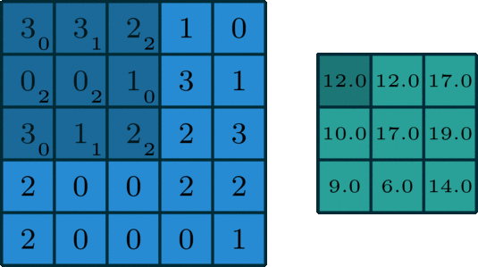
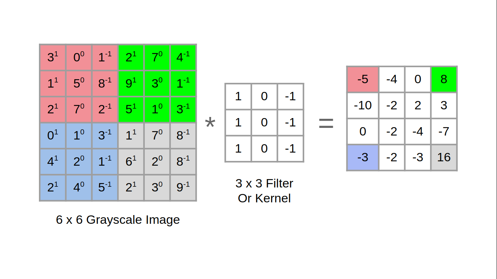

# **Foundations of CNN**

## **Computer vision**

- Computer vision is one of the applications that are rapidly active thanks to deep learning.
- Some of the applications of computer vision that are using deep learning includes:
  - **Self driving cars**.
  - **Face recognition**.
- Deep learning is also enabling new types of art to be created.
- Rapid changes to computer vision are making new applications that weren't possible a few years ago.
- Computer vision deep leaning techniques are always evolving making a new architectures which can help us in other areas other than computer vision.
  - For example, Andrew Ng took some ideas of computer vision and applied it in speech recognition.
- Examples of a computer vision problems includes:
  - Image classification.
  - Object detection.
    - Detect object and localize them.
  - Neural style transfer
    - Changes the style of an image using another image.
- One of the challenges of computer vision problem that images can be so large and we want a fast and accurate algorithm to work with that.
  - For example, a **1000 x 1000** image will represent 3 million feature/input to the full connected neural network. If the following hidden layer contains 1000 units, then we will want to learn weights of the shape **[ 1000, 3 million ]** which is 3 billion parameter only in the first layer and that's so computationally expensive!
- One of the solutions is to build this using **convolution layers** instead of the **fully connected layers**.


## **Edge detection example**

- The convolution operation is one of the fundamentals blocks of a CNN. One of the examples about convolution is the image edge detection operation.

  

  Source: [Intuitively Understanding Convolutions for Deep Learning](https://towardsdatascience.com/intuitively-understanding-convolutions-for-deep-learning-1f6f42faee1)

- Early layers of CNN might detect edges then the middle layers will detect parts of objects and the later layers will put the these parts together to produce an output.

- In an image we can detect vertical edges, horizontal edges, or full edge detector.

- Vertical edge detection:

  - An example of convolution operation to detect vertical edges:
    
  - In the last example a `6x6` matrix convolved with `3x3` filter/kernel gives us a `4x4` matrix.
  - If you make the convolution operation in TensorFlow you will find the function **`tf.nn.conv2d`**. In keras you will find **`Conv2d`** function.
  - The vertical edge detection filter will find a `3x3` place in an image where there are a bright region followed by a dark region.
  - If we applied this filter to a white region followed by a dark region, it should find the edges in between the two colours as a positive value. But if we applied the same filter to a dark region followed by a white region it will give us negative values. To solve this we can use the abs function to make it positive.
  
- For horizontal edge detection filter/kernel would be like this

  ```
   1	 1	 1
   0	 0	 0
   -1	-1	-1
  ```
  
- There are a lot of ways we can put number inside the horizontal or vertical edge detections. For example here are the vertical **Sobel** filter (The idea is taking care of the middle row):

  ```
   1	0	-1
   2	0	-2
   1	0	-1
  ```

- Also something called **Scharr** filter (The idea is taking great care of the middle row):

  ```
    3	0	 -3
   10	0	-10
    3	0	 -3
  ```

- What we learned in the deep learning is that we don't need to hand craft these numbers, we can treat them as weights and then learn them. It can learn horizontal, vertical, angled, or any edge type automatically rather than getting them by hand.

## Padding

- In order to to use deep neural networks we really need to use **paddings**.

- In the last section we saw that a 6 x 6 matrix convolved with 3 x 3 filter/kernel gives us a 4 x 4 matrix.

- To give it a general rule, if a matrix <a href="https://www.codecogs.com/eqnedit.php?latex=\inline&space;\textbf&space;n&space;\times&space;\textbf&space;n" target="_blank"></a> is convolved with <a href="https://www.codecogs.com/eqnedit.php?latex=\inline&space;\textbf&space;f&space;\times&space;\textbf&space;f" target="_blank"></a> filter/kernel give us <a href="https://www.codecogs.com/eqnedit.php?latex=\inline&space;(\textbf&space;n&space;-&space;\textbf&space;f&space;&plus;&space;\textbf&space;1)&space;\times&space;(\textbf&space;n&space;-&space;\textbf&space;f&space;&plus;&space;\textbf&space;1)" target="_blank"></a> matrix. 

- The convolution operation shrinks the matrix if <a href="https://www.codecogs.com/eqnedit.php?latex=\inline&space;\textbf&space;f&space;>&space;\textbf&space;1" target="_blank">&space;\textbf&space;1" title="\textbf f > \textbf 1" /></a>.

- We want to apply convolution operation multiple times, but if the image shrinks we will lose a lot of data on this process. Also the edges pixels are used less than other pixels in an image.

- So the problems with convolutions are:

  - Shrinks output.
  - throwing away a lot of information that are in the edges.

- To solve these problems we can pad the input image before convolution by adding some rows and columns to it. We will call the padding amount <a href="https://www.codecogs.com/eqnedit.php?latex=\inline&space;\textbf&space;p" target="_blank"></a> the number of row/columns that we will insert in top, bottom, left and right of the image.

- In almost all the cases the padding values are zeros.

- The general rule now,  if a matrix <a href="https://www.codecogs.com/eqnedit.php?latex=\inline&space;\textbf&space;n&space;\times&space;\textbf&space;n" target="_blank"></a> is convolved with <a href="https://www.codecogs.com/eqnedit.php?latex=\inline&space;\textbf&space;f&space;\times&space;\textbf&space;f" target="_blank"></a> filter/kernel and padding <a href="https://www.codecogs.com/eqnedit.php?latex=\inline&space;\textbf&space;p" target="_blank"></a> give us <a href="https://www.codecogs.com/eqnedit.php?latex=\inline&space;(\textbf&space;n&space;&plus;&space;\textbf&space;2&space;\textbf&space;p&space;-\textbf&space;f&space;&plus;&space;\textbf&space;1)&space;\times&space;(\textbf&space;n&space;&plus;&space;\textbf&space;2&space;\textbf&space;p&space;-\textbf&space;f&space;&plus;&space;\textbf&space;1)" target="_blank"></a> matrix. 

- If n = 6, f = 3, and p = 1 Then the output image will have 

  n + 2p - f + 1 = 6 + 2 - 3 + 1 = 6

  We maintain the size of the image.

- **Same convolutions** is a convolution with a pad so that output size is the same as the input size. Its given by the equation:

  <a href="https://www.codecogs.com/eqnedit.php?latex=\inline&space;\textbf&space;p&space;=&space;(\textbf&space;f-&space;\textbf&space;1)&space;/&space;\textbf&space;2" target="_blank"></a>

- In computer vision **f** is usually odd. Some of the reasons is that it will have a centre value.

## Strided convolution

- Strided convolution is another piece that are used in CNNs.

- We will call stride **`S`**.

- When we are making the convolution operation we used **`S`** to tell us the number of pixels we will jump when we are convolving filter/kernel. The last examples we described S was 1.

- Now the general rule is:

  - if a matrix <a href="https://www.codecogs.com/eqnedit.php?latex=\inline&space;\textbf&space;n&space;\times&space;\textbf&space;n" target="_blank"></a> is convolved with <a href="https://www.codecogs.com/eqnedit.php?latex=\inline&space;\textbf&space;f&space;\times&space;\textbf&space;f" target="_blank"></a> filter/kernel and padding <a href="https://www.codecogs.com/eqnedit.php?latex=\inline&space;\textbf&space;p" target="_blank"></a> and stride <a href="https://www.codecogs.com/eqnedit.php?latex=\inline&space;\LARGE&space;\textbf&space;s" target="_blank"></a> it give us 

    <a href="https://www.codecogs.com/eqnedit.php?latex=\dpi{120}&space;\frac{(\textbf&space;n&space;&plus;&space;\textbf&space;2&space;\textbf&space;p&space;-&space;\textbf&space;f)}{\textbf&space;s}&space;&plus;&space;\textbf&space;1,\frac{(\textbf&space;n&space;&plus;&space;\textbf&space;2&space;\textbf&space;p&space;-&space;\textbf&space;f)}{\textbf&space;s}&space;&plus;&space;\textbf&space;1" target="_blank"></a>

    matrix. 

- In case <a href="https://www.codecogs.com/eqnedit.php?latex=\inline&space;\dpi{150}&space;\frac{(\textbf&space;n&space;&plus;&space;\textbf&space;2&space;\textbf&space;p&space;-&space;\textbf&space;f)}{\textbf&space;s}&space;&plus;&space;\textbf&space;1" target="_blank"></a> is fraction we can take **floor** of this value.

- In math textbooks the conv operation is filpping the filter before using it. What we were doing is called cross-correlation operation but the state of art of deep learning is using this as conv operation.

- Same convolutions is a convolution with a padding so that output size is the same as the input size. Its given by the equation:

  <a href="https://www.codecogs.com/eqnedit.php?latex=\inline&space;\large&space;\textbf&space;p&space;=&space;(\textbf&space;n&space;\times&space;\textbf&space;s&space;-&space;\textbf&space;n&space;&plus;&space;\textbf&space;f&space;-&space;\textbf&space;s)&space;/&space;2" target="_blank"></a>

  when

  <a href="https://www.codecogs.com/eqnedit.php?latex=\inline&space;\large&space;\textbf&space;s&space;=&space;\textbf&space;1&space;\implies&space;\textbf&space;p&space;=&space;(\textbf&space;f&space;-&space;\textbf&space;1)&space;/&space;\textbf&space;2" target="_blank"></a>

## Convolutions over volumes

- We see how convolution works with 2D images, now lets see if we want to convolve 3D images (RGB image)
- We will convolve an image of height, width, # of channels with a filter of a height, width, same # of channels. Hint that the image number channels and the filter number of channels are the same.
- We can call this as stacked filters for each channel!
- Example:
  - Input image: 6 x 6 x 3
  - Filter: 3 x 3 x 3
  - Result image: 4 x 4 x 1
  - In the last result <a href="https://www.codecogs.com/eqnedit.php?latex=\inline&space;\large&space;\textbf&space;p&space;=&space;\textbf&space;0" target="_blank"></a>, <a href="https://www.codecogs.com/eqnedit.php?latex=\inline&space;\dpi{120}&space;\large&space;\textbf&space;s&space;=&space;\textbf1" target="_blank"></a>
- Hint the output here is only 2D.
- We can use multiple filters to detect multiple features or edges. Example.
  - Input image: 6 x 6 x 3
  - 10 Filters: 3 x 3 x 3
  - Result image: 4 x 4 x 10
  - In the last result <a href="https://www.codecogs.com/eqnedit.php?latex=\inline&space;\large&space;\textbf&space;p&space;=&space;\textbf&space;0" target="_blank"></a>, <a href="https://www.codecogs.com/eqnedit.php?latex=\inline&space;\dpi{120}&space;\large&space;\textbf&space;s&space;=&space;\textbf1" target="_blank"></a>

### One Layer of a Convolutional Network

- First we convolve some filters to a given input and then add a bias to each filter output and then get RELU of the result. Example:

  - Input image: 6 x 6 x 3        <a href="https://www.codecogs.com/eqnedit.php?latex=\inline&space;\large&space;\textbf&space;a^{\textbf&space;[&space;\textbf&space;0&space;\textbf&space;]}" target="_blank"></a>
  - 10 Filters: 3 x 3 x 3              <a href="https://www.codecogs.com/eqnedit.php?latex=\inline&space;\textbf&space;W^{\textbf&space;[&space;\textbf&space;1&space;\textbf&space;]}" target="_blank"></a>
  - Result image: 4 x 4 x 10      <a href="https://www.codecogs.com/eqnedit.php?latex=\inline&space;\textbf&space;W^{\textbf&space;[&space;\textbf&space;1&space;\textbf&space;]}&space;\textbf&space;a^{\textbf&space;[&space;\textbf&space;0&space;\textbf&space;]}" target="_blank"></a>
  - Add <a href="https://www.codecogs.com/eqnedit.php?latex=\inline&space;\textbf&space;b" target="_blank"></a> (bias) with 10 x 1  will get us : 4 x 4 x 10 image      <a href="https://www.codecogs.com/eqnedit.php?latex=\inline&space;\textbf&space;W^{\textbf&space;[&space;\textbf&space;1&space;\textbf&space;]}&space;\textbf&space;a^{\textbf&space;[&space;\textbf&space;0&space;\textbf&space;]}&space;&plus;&space;\textbf&space;b" target="_blank"></a>
  - Apply RELU will get us: 4 x 4 x 10 image                **A1** = **ReLU**(<a href="https://www.codecogs.com/eqnedit.php?latex=\inline&space;\textbf&space;W^{\textbf&space;[&space;\textbf&space;1&space;\textbf&space;]}&space;\textbf&space;a^{\textbf&space;[&space;\textbf&space;0&space;\textbf&space;]}&space;&plus;&space;\textbf&space;b" target="_blank"></a>)
  - In the last result <a href="https://www.codecogs.com/eqnedit.php?latex=\inline&space;\large&space;\textbf&space;p&space;=&space;\textbf&space;0" target="_blank"></a>, <a href="https://www.codecogs.com/eqnedit.php?latex=\inline&space;\dpi{120}&space;\large&space;\textbf&space;s&space;=&space;\textbf1" target="_blank"></a>
  - Hint number of parameters here are: **(3 x 3 x 3 x 10) + 10 = 280**

- The last example forms a layer in the CNN.

- Hint: no matter the size of the input, the number of the parameters is same if filter size is same. That makes it less prone to over-fitting.

- Here are some notations we will use. If layer l is a conv layer:

  <a href="https://www.codecogs.com/eqnedit.php?latex=\large&space;\textbf&space;f^{\hspace{.1cm}&space;\textbf&space;[\hspace{.05cm}&space;l&space;\hspace{.05cm}&space;\textbf&space;]}&space;=&space;filter&space;\hspace{.1cm}&space;size" target="_blank"></a> 						  	**Input Size**: <a href="https://www.codecogs.com/eqnedit.php?latex=\large&space;\textbf&space;n_H^{\textbf[l-1\textbf]}&space;\times&space;\textbf&space;n_W^{\textbf[l-1\textbf]}&space;\times&space;\textbf&space;n_c^{[l-1]}" target="_blank"></a>

  <a href="https://www.codecogs.com/eqnedit.php?latex=\large&space;\textbf&space;p^{\hspace{.1cm}&space;\textbf&space;[\hspace{.05cm}&space;l&space;\hspace{.05cm}&space;\textbf&space;]}&space;=&space;padding&space;\hspace{.2cm}&space;(default&space;\hspace{.2cm}&space;0)" target="_blank"></a>      **Output Size**: <a href="https://www.codecogs.com/eqnedit.php?latex=\large&space;\textbf&space;n_H^{\textbf[l\textbf]}&space;\times&space;\textbf&space;n_W^{\textbf[l\textbf]}&space;\times&space;\textbf&space;n_c^{\textbf&space;[l\textbf]}" target="_blank"></a>	

  <a href="https://www.codecogs.com/eqnedit.php?latex=\large&space;\textbf&space;s^{\hspace{.1cm}&space;\textbf&space;[\hspace{.05cm}&space;l&space;\hspace{.05cm}&space;\textbf&space;]}&space;=&space;stride" target="_blank"></a> 									  where <a href="https://www.codecogs.com/eqnedit.php?latex=\textbf&space;n_{H/W}^{\textbf[l\textbf]}&space;=&space;\Biggl\lfloor{\left(\frac{\textbf&space;n_{H/W}^{\textbf&space;[l&space;-&space;1&space;\textbf&space;]}&space;&plus;&space;\textbf{2p}^{\textbf[l\textbf]}&space;-&space;\textbf&space;f^{\textbf[l\textbf]}}{\textbf&space;s\textbf[l\textbf]}\right)&space;&plus;&space;\textbf&space;1}\Biggl\rfloor" target="_blank"></a>

  <a href="https://www.codecogs.com/eqnedit.php?latex=\large&space;\textbf&space;n_c^{\textbf&space;[\hspace{0.05cm}l\hspace{0.05cm}\textbf&space;]}&space;=&space;number&space;\hspace{0.2cm}&space;of&space;\hspace{0.2cm}&space;filters" target="_blank"></a> 		Each filter is: <a href="https://www.codecogs.com/eqnedit.php?latex=\textbf&space;f^{\textbf&space;[l\textbf&space;]}&space;\times&space;\textbf&space;f^{\textbf&space;[l\textbf&space;]}&space;\times&space;\textbf&space;n_c^{[l-1]}" target="_blank"></a> 

  ```
  Hyperparameters
  f[l] = filter size
  p[l] = padding	# Default is zero
  s[l] = stride
  nc[l] = number of filters
  
  Input:  n[l-1] x n[l-1] x nc[l-1]	Or	 nH[l-1] x nW[l-1] x nc[l-1]
  Output: n[l] x n[l] x nc[l]	Or	 nH[l] x nW[l] x nc[l]
  Where n[l] = (n[l-1] + 2p[l] - f[l] / s[l]) + 1
  
  Each filter is: f[l] x f[l] x nc[l-1]
  
  Activations: a[l] is nH[l] x nW[l] x nc[l]
  		     A[l] is m x nH[l] x nW[l] x nc[l]   # In batch or minbatch training
  		     
  Weights: f[l] * f[l] * nc[l-1] * nc[l]
  bias:  (1, 1, 1, nc[l])
  ```

### A simple convolution network example